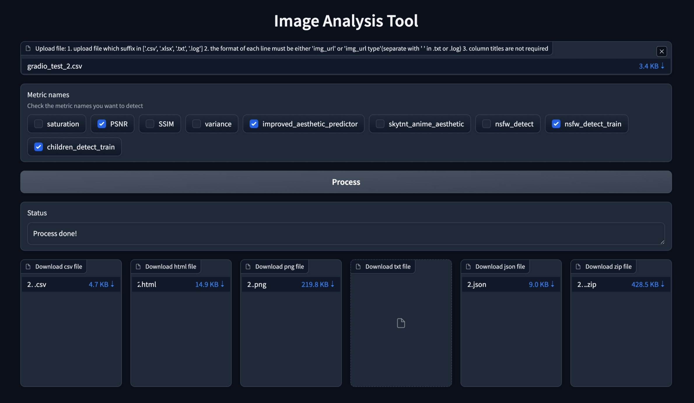

# ImageEvaluation
ImageEvaluation is an image quality evaluation pipeline that automatically analyzes and scores images based on various metrics such as saturation, aesthetics, nsfw. 

Finally, these scores are normalized to 0~1 respectively and the weighted scores are calculated.
## Install
```shell
git clone https://github.com/RobertLau666/ImageEvaluation.git

conda create -n imageevaluation python=3.10
conda activate imageevaluation

cd ImageEvaluation
pip install -r requirements.txt
```
## Models
1. Manually download models from [improved-aesthetic-predictor](https://github.com/christophschuhmann/improved-aesthetic-predictor), [skytnt_anime_aesthetic](https://huggingface.co/skytnt/anime-aesthetic/tree/main), [TostAI/nsfw-image-detection-large](https://huggingface.co/TostAI/nsfw-image-detection-large/tree/main), [ViT-L-14.pt](https://openaipublic.azureedge.net/clip/models/b8cca3fd41ae0c99ba7e8951adf17d267cdb84cd88be6f7c2e0eca1737a03836/ViT-L-14.pt), place them in folder ```images_evaluation_models```, in addition, other models will be downloaded automatically when the program starts.
2. Place the folder ```images_evaluation_models``` in the same level of directory as the project folder ```ImageEvaluation```, the directory structure is as follows:
```
| ImageEvaluation/
| images_evaluation_models/
|---- improved_aesthetic_predictor_models/
|-------- ViT-L-14.pt
|-------- ava+logos-l14-linearMSE.pth
|-------- ava+logos-l14-reluMSE.pth
|-------- sac+logos+ava1-l14-linearMSE.pth
|---- nsfw_detect_models/
|-------- nsfw-image-detection-large/
|---- nsfw_detect_train_models/
|---- skytnt_anime_aesthetic_models/
|-------- model.ckpt
|-------- model.onnx
```
## Run
### Code
Revise parameters ```metric_params``` and ```test_images_dirs_or_files``` in the ```config.py```.
```
python app.py
```
### Gradio
```
python app_gradio.py
```

## Result
The results include the following:
### 1. folder ```xlsx``` or ```csv```
The normalized scores for each metric and normalized weighted scores for each image in each file or folder in parameter ```test_images_dirs_or_files```.

### 2. folder ```png```
The plots according to the column titles ```"nsfw_detect_train_score_normed"``` and ```"children_detect_train_score_normed"```, classify by ```type``` in each plot. You can see the proportion of different normalized scores.

### 3. folder ```html```
The html report of normalized scores for each metric and normalized weighted scores for each image in each file or folder in parameter ```test_images_dirs_or_files```. You can filter the ```type```, order different metrics in ascending and descending order, and view the image.

### 4. folder ```txt```
During the evaluation process, if the image path or url cannot be loaded, this image will be skipped, and its ```index```, ```img_path_or_url```, ```type``` will be recorded in a txt file.
### 5. folder ```json```
The parameter ```metric_params```, the average scores and the average normalized scores for each metric, and the average weighted normalized scores for each file or folder in parameter ```test_images_dirs_or_files```.

data/input/demo/test_images_1.csv
|  |  |  |  |  |
|------|------|------|------|------|
|  |  |  |  |  | 
```json
{
    "saturation": {
        "average_saturation_score": 110.68278628414751,
        "average_saturation_score_normed": 0.7550276252166752,
        "average_saturation_time": 0.012058877944946289
    },
    "PSNR": {
        "average_PSNR_score": 7.412721149820788,
        "average_PSNR_score_normed": 0.6889811394075319,
        "average_PSNR_time": 0.0007004737854003906
    },
    "SSIM": {
        "average_SSIM_score": -0.006803741715732356,
        "average_SSIM_score_normed": 0.4965981291421338,
        "average_SSIM_time": 0.028401279449462892
    },
    "variance": {
        "average_variance_score": 72.05969989333389,
        "average_variance_score_normed": 0.9557043066971325,
        "average_variance_time": 0.001936054229736328
    },
    "improved_aesthetic_predictor": {
        "average_improved_aesthetic_predictor_score": 6.398706531524658,
        "average_improved_aesthetic_predictor_score_normed": 0.6568395915148125,
        "average_improved_aesthetic_predictor_time": 0.09810209274291992
    },
    "skytnt_anime_aesthetic": {
        "average_skytnt_anime_aesthetic_score": 0.4729860067367554,
        "average_skytnt_anime_aesthetic_score_normed": 0.4729860067367554,
        "average_skytnt_anime_aesthetic_time": 2.116146373748779
    },
    "nsfw_detect": {
        "average_nsfw_detect_score": 0.004239956592209637,
        "average_nsfw_detect_score_normed": 0.9957600434077903,
        "average_nsfw_detect_time": 0.996024227142334
    },
    "nsfw_detect_train": {
        "average_nsfw_detect_train_score": 0.2,
        "average_nsfw_detect_train_score_normed": 0.9,
        "average_nsfw_detect_train_time": 0.26923203468322754
    },
    "children_detect_train": {
        "average_children_detect_train_score": 0.6,
        "average_children_detect_train_score_normed": 0.4,
        "average_children_detect_train_time": 0.24373717308044435
    },
    "average_weighted_score_normed": 0.7024329824580924
}
```