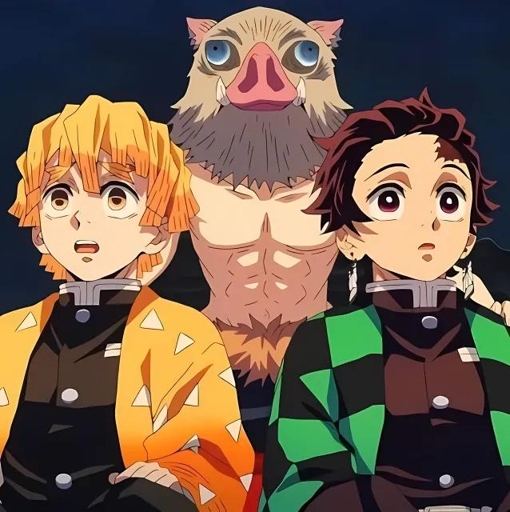
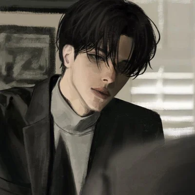
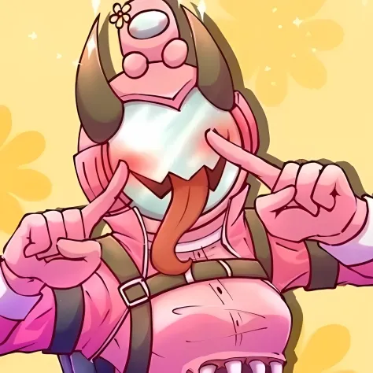
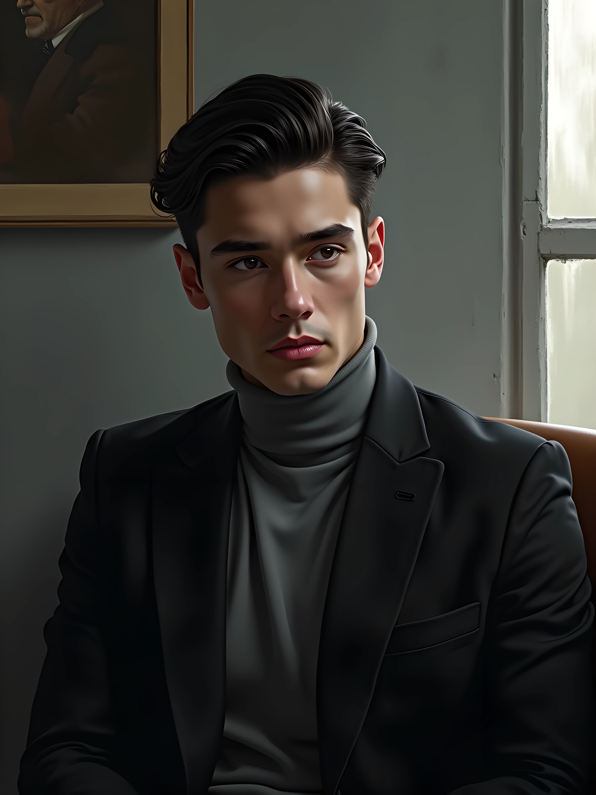

# ImageEvaluation
ImageEvaluation is an image quality evaluation pipeline that automatically analyzes and scores images based on various metrics such as saturation, aesthetics, nsfw. 
## Install
```shell
git clone https://github.com/RobertLau666/ImageEvaluation.git

conda create -n imageevaluation python=3.10
conda activate imageevaluation

cd ImageEvaluation
pip install -r requirements.txt
```
## Models
1. Download models from [improved-aesthetic-predictor](https://github.com/christophschuhmann/improved-aesthetic-predictor), [skytnt_anime_aesthetic](https://huggingface.co/skytnt/anime-aesthetic/tree/main), [TostAI/nsfw-image-detection-large](https://huggingface.co/TostAI/nsfw-image-detection-large/tree/main), [ViT-L-14.pt](https://openaipublic.azureedge.net/clip/models/b8cca3fd41ae0c99ba7e8951adf17d267cdb84cd88be6f7c2e0eca1737a03836/ViT-L-14.pt), place them in folder ```images_evaluation_models```.
2. Place the folder ```images_evaluation_models``` in the same level of directory as the project folder ```ImageEvaluation```, the directory structure is as follows:
```
| ImageEvaluation/
| images_evaluation_models/
|---- improved_aesthetic_predictor_models/
|-------- ViT-L-14.pt
|-------- ava+logos-l14-linearMSE.pth
|-------- ava+logos-l14-reluMSE.pth
|-------- sac+logos+ava1-l14-linearMSE.pth
|---- nsfw_detector_models/
|-------- nsfw-image-detection-large/
|---- skytnt_anime_aesthetic_models/
|-------- model.ckpt
|-------- model.onnx
```
## Run
```
python app.py
```
## Result
./test_images/test_images_1
|  |  |  |  |  |
|------|------|------|------|------|
|  |  |  |  |  | 
```json
{
    "average saturation": 70.83403901883534,
    "average PSNR score": 7.289147809740328,
    "average SSIM score": 0.19229470042863483,
    "average variance score": 0.9251300239103534,
    "average aesthetic predictor score": 5.54738712310791,
    "average skytnt anime aesthetic score": 0.36774230301380156,
    "average nsfw score": 0.0632169061806053,
    "weighted_final_score": 12.17413684074528
}
```

./test_images/test_images_2
|  |  |  |  |  |
|------|------|------|------|------|
|  |  |  |  |  | 
```json
{
    "average saturation": 73.14979101110387,
    "average PSNR score": 7.5285347139762955,
    "average SSIM score": 0.12093097034392095,
    "average variance score": 0.9327369938113375,
    "average aesthetic predictor score": 6.426067352294922,
    "average skytnt anime aesthetic score": 0.4780025467276573,
    "average nsfw score": 0.005414966342505068,
    "weighted_final_score": 12.663068364942928
}
```