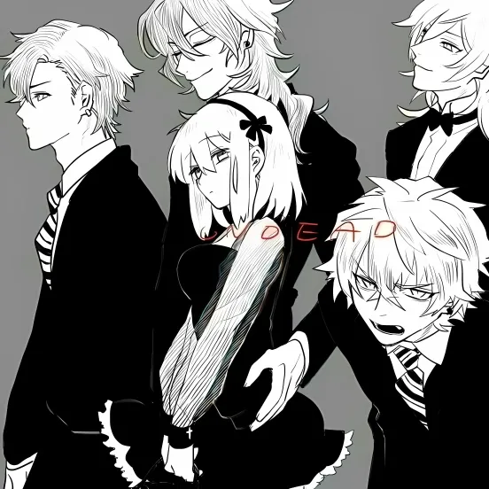

# ImageEvaluation
ImageEvaluation is an image quality evaluation pipeline that automatically analyzes and scores images based on various metrics such as saturation, aesthetics, nsfw. Finally, these scores are normalized to 0~1 respectively and the weighted scores are calculated.
## Install
```shell
git clone https://github.com/RobertLau666/ImageEvaluation.git

conda create -n imageevaluation python=3.10
conda activate imageevaluation

cd ImageEvaluation
pip install -r requirements.txt
```
## Models
1. Manually download models from [improved-aesthetic-predictor](https://github.com/christophschuhmann/improved-aesthetic-predictor), [skytnt_anime_aesthetic](https://huggingface.co/skytnt/anime-aesthetic/tree/main), [TostAI/nsfw-image-detection-large](https://huggingface.co/TostAI/nsfw-image-detection-large/tree/main), [ViT-L-14.pt](https://openaipublic.azureedge.net/clip/models/b8cca3fd41ae0c99ba7e8951adf17d267cdb84cd88be6f7c2e0eca1737a03836/ViT-L-14.pt), place them in folder ```images_evaluation_models```, in addition, some models are downloaded automatically.
2. Place the folder ```images_evaluation_models``` in the same level of directory as the project folder ```ImageEvaluation```, the directory structure is as follows:
```
| ImageEvaluation/
| images_evaluation_models/
|---- improved_aesthetic_predictor_models/
|-------- ViT-L-14.pt
|-------- ava+logos-l14-linearMSE.pth
|-------- ava+logos-l14-reluMSE.pth
|-------- sac+logos+ava1-l14-linearMSE.pth
|---- nsfw_detect_models/
|-------- nsfw-image-detection-large/
|---- skytnt_anime_aesthetic_models/
|-------- model.ckpt
|-------- model.onnx
```
## Run
Revise parameters in the ```config.py```
```
python app.py
```
## Result
data/test_images_dirs/test_images_dir_1
|  |  |  |  |  |
|------|------|------|------|------|
|  |  |  |  |  | 
```json
{
    "average saturation score": 0.5896600860005143,
    "average PSNR score": 0.6914899355883903,
    "average SSIM score": 0.5763519795439007,
    "average variance score": 0.9558609204319042,
    "average improved_aesthetic_predictor score": 0.6152146054115153,
    "average skytnt_anime_aesthetic score": 0.2086948871612549,
    "average nsfw_detect score": 0.9917859493754804,
    "average nsfw_detect_train score": 1.0,
    "average weighted score": 0.7036322954391201
}
```

data/test_images_dirs/test_images_dir_2
|  |  |  |  |  |
|------|------|------|------|------|
|  |  |  |  |  | 
```json
{
    "average saturation score": 0.6587717069691541,
    "average PSNR score": 0.6943166760699839,
    "average SSIM score": 0.5496450507060965,
    "average variance score": 0.9518829295543035,
    "average improved_aesthetic_predictor score": 0.6478214362853942,
    "average skytnt_anime_aesthetic score": 0.23886614739894868,
    "average nsfw_detect score": 0.9916211858391761,
    "average nsfw_detect_train score": 1.0,
    "average weighted score": 0.7166156416028822
}
```

data/test_images_csvs/test_images_csv_1.csv
|  |  |  |  |  |
|------|------|------|------|------|
|  |  |  |  |  | 
```json
{
    "average saturation score": 0.7550276252166752,
    "average PSNR score": 0.6889811394075319,
    "average SSIM score": 0.4965981291421338,
    "average variance score": 0.9557043066971325,
    "average improved_aesthetic_predictor score": 0.6568566799363091,
    "average skytnt_anime_aesthetic score": 0.4729860067367554,
    "average nsfw_detect score": 0.9957600434077903,
    "average nsfw_detect_train score": 0.8,
    "average weighted score": 0.727739241318041
}
```